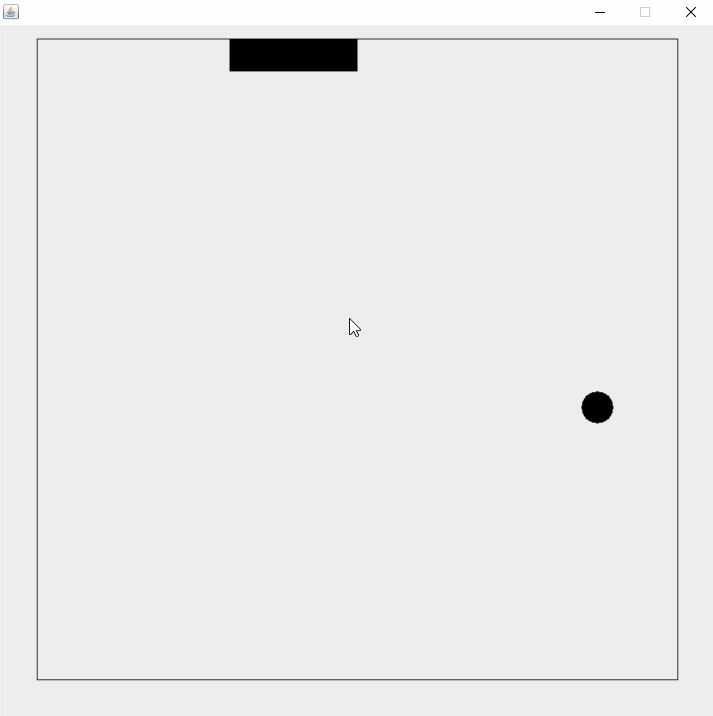

# snake
贪吃蛇-Java

## Environment

\>=jre7

## Get Start
`mvn assembly:assembly`

`java -jar target/snake-2.0-jar-with-dependencies.jar`

##  Description

| button    | action         |
| --------- | -------------- |
| w/↑       | turn up        |
| s/↓       | turn down      |
| a/←       | turn left     |
| d/→       | turn right     |
| space     | pause/continue |
| r         | restart game   |
| page up   | speed up       |
| page down | speed down     |

